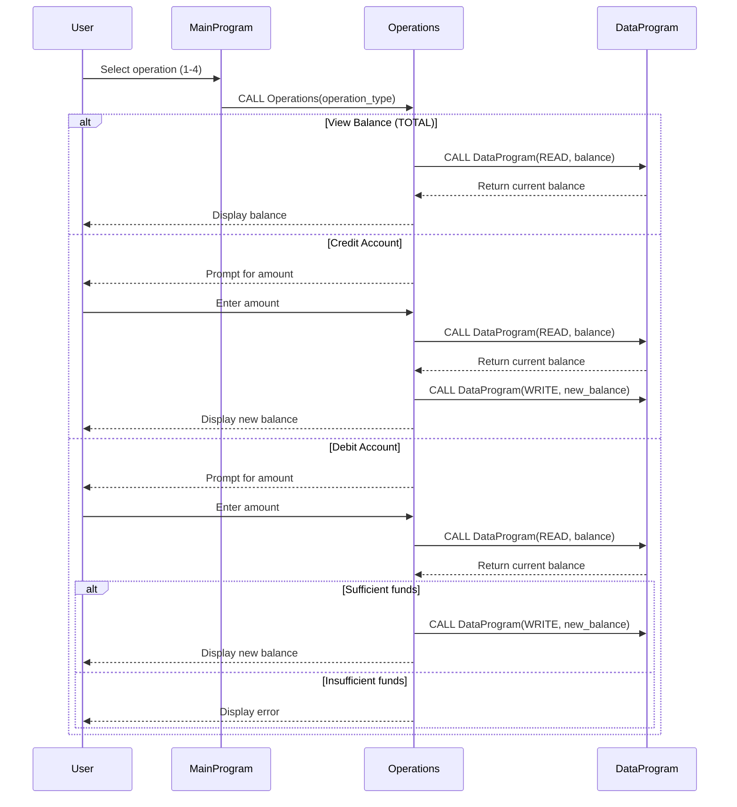

# COBOL Student Account Management System

This project contains a COBOL-based system for managing student financial accounts. The system allows viewing account balances, crediting funds, and debiting funds with basic validation.

## COBOL Files Overview

### data.cob
**Purpose**: Handles persistent storage and retrieval of account balance data.

**Key Functions**:
- Stores the account balance in working storage (initialized to $1000.00)
- Supports READ operations to retrieve the current balance
- Supports WRITE operations to update the stored balance
- Uses linkage section for parameter passing between programs

**Business Rules**:
- Maintains a single balance value for the student account
- Initial balance is set to $1000.00 (possibly a default starting balance for new student accounts)

### main.cob
**Purpose**: Provides the main user interface and program flow control for the account management system.

**Key Functions**:
- Displays a menu-driven interface with options for account operations
- Accepts user input for menu selections
- Calls the Operations program with appropriate operation types
- Handles program exit logic

**Business Rules**:
- Menu options include: View Balance, Credit Account, Debit Account, Exit
- Validates user input (accepts only 1-4)
- Continues operation until user chooses to exit

### operations.cob
**Purpose**: Implements the core business logic for account operations (view, credit, debit).

**Key Functions**:
- Processes different operation types: TOTAL (view balance), CREDIT (add funds), DEBIT (subtract funds)
- Handles user input for transaction amounts
- Performs balance calculations and updates
- Displays operation results and error messages

**Business Rules**:
- **Credit Operations**: Allows adding any positive amount to the account balance
- **Debit Operations**: 
  - Requires sufficient funds before allowing debit
  - Displays "Insufficient funds" error if balance is less than debit amount
  - Only processes debit if funds are available
- **Balance Viewing**: Displays current account balance
- All operations update the persistent balance storage via the DataProgram

## System Architecture
The system follows a modular COBOL architecture:
- `main.cob`: Entry point and user interface
- `operations.cob`: Business logic layer
- `data.cob`: Data persistence layer

Programs communicate through CALL statements and linkage sections, maintaining separation of concerns.

## Sequence Diagram

